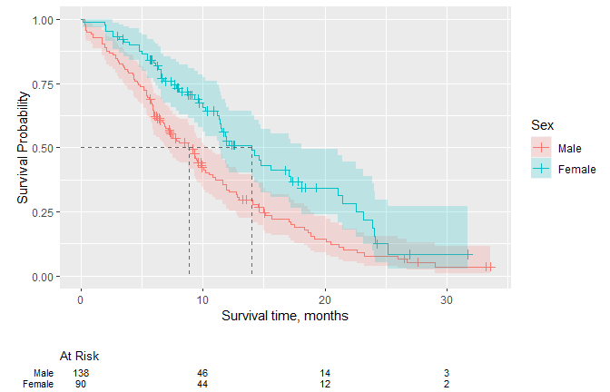

<!-- README.md is generated from README.Rmd. Please edit that file -->

# ggsurvfit

<!-- badges: start -->

[](https://lifecycle.r-lib.org/articles/stages.html#experimental)
[](https://github.com/ddsjoberg/ggsurvfit/actions/workflows/R-CMD-check.yaml)
[](https://CRAN.R-project.org/package=ggsurvfit)
[](https://app.codecov.io/gh/ddsjoberg/ggsurvfit?branch=main)
<!-- badges: end -->

## Introduction

The {ggsurvfit} package eases the creation of time-to-event (aka
survival) endpoint figures with ggplot2. The concise and modular code
creates images that are ready for publication or sharing. Competing
risks cumulative incidence is also supported via `ggcuminc()`.

## Why ggsurvfit?

-   **Publishable Legends** Raw variable names do not appear in the
    figure legend, e.g. `"sex=Female"`.

-   **Use ggplot2 functions** Each {ggsurvfit} add-on function
    (e.g. `add_confidence_interval()`, `add_risktable()`, etc.) is
    written as a proper ggplot2 ‘geom’, meaning that the package
    functions can be woven with ggplot2 functions seamlessly.

-   **Limitless Customization** You can modify the x-axis scales or any
    other plot feature and the risk table will still align with the
    plot.

## Installation

You can install the development version of ggsurvfit from
[GitHub](https://github.com/ddsjoberg/ggsurvfit) with:

``` r
# install.packages("devtools")
devtools::install_github("ddsjoberg/ggsurvfit")
```

## Examples

Let’s begin with an example illustrating a common Kaplan-Meier survival
curve.

``` r
library(ggsurvfit)
library(ggplot2)

survfit2(Surv(AVAL, 1 - CNSR) ~ STR01, data = adtte) |>
  # build Kaplan-Meier plot ----------------------------------------------------
  ggsurvfit(size = 1) +
  add_confidence_interval() +
  add_risktable() +
  add_quantile(color = "gray50", size = 0.9) +
  # use ggplot2 functions to style the plot and update the labels --------------
  labs(
    y = "Probability of survival",
    title = "Kaplan-Meier Estimate of Survival by Hormone Receptor Status",
    # remove the fill and color legend labels (Sex appears in title)
    fill = NULL, color = NULL
  ) +
  # reduce padding on edges of figure, and format axes
  scale_y_continuous(label = scales::percent, expand = c(0.015, 0)) +
  scale_x_continuous(breaks = 0:5, expand = c(0.02, 0))
```



## `survfit2()` vs `survfit()`

Both functions have identical inputs, so why do we need `survfit2()`?
The `survfit2()` tracks the environment from which the function was
called, resulting in the following benefits.

-   We can reliably remove the raw variable names from the figure
    legend, e.g. `SEX=Female`.
-   The figure legend label can be extracted from the original data,
    providing a more informative figure.
-   P-values can be calculated with `survfit_p()` and added to figures.
-   The items above are often *possible* using `survfit()`. However, by
    utilizing the calling environment we are assured the correct
    elements are found, rather crossing your fingers that the search
    path contains the needed elements.
