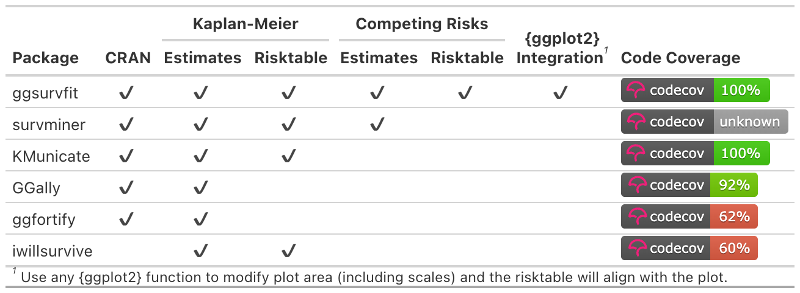

<!-- README.md is generated from README.Rmd. Please edit that file -->

# ggsurvfit <a href="https://www.danieldsjoberg.com/ggsurvfit/"></a>

<!-- badges: start -->

[](https://github.com/pharmaverse/ggsurvfit/actions/workflows/R-CMD-check.yaml)
[](https://app.codecov.io/gh/pharmaverse/ggsurvfit)
[](https://CRAN.R-project.org/package=ggsurvfit)
[](https://cran.r-project.org/package=ggsurvfit)
[](https://pharmaverse.org)
<!-- badges: end -->

## Introduction

The **ggsurvfit** package eases the creation of time-to-event (aka
survival) summary figures with ggplot2. The concise and modular code
creates images that are ready for publication or sharing. Competing
risks cumulative incidence is also supported via `ggcuminc()`.

## Why ggsurvfit?

- **Use ggplot2 functions:** Each **ggsurvfit** add-on function
  (e.g. `add_confidence_interval()`, `add_risktable()`, etc.) is written
  as a proper ggplot2
  [‘geom’](https://ggplot2.tidyverse.org/reference/index.html), meaning
  the package functions can be woven with ggplot2 functions seamlessly.
  You don’t need to learn how to style the plot within the ggsurvfit
  functions: rather, rely on the suite of ggplot2 functions you already
  know.

- **Publishable Legends:** Raw variable names do not appear in the
  figure legend, e.g. `"sex=Female"`.

- **Limitless Customization:** You can modify the x-axis scales or any
  other plot feature and the risk table will still align with the plot.

- **Simple Saving:** Save individual images easily with
  `ggplot2::ggsave()`.

## Installation

Install **ggsurvfit** from CRAN with:

``` r
install.packages("ggsurvfit")
```

You can install the development version from
[GitHub](https://github.com/pharmaverse/ggsurvfit) with:

``` r
# install.packages("devtools")
devtools::install_github("pharmaverse/ggsurvfit")
```

## Examples

Review the [**figure
gallery**](https://www.danieldsjoberg.com/ggsurvfit/articles/gallery.html)
for many more examples.

The code below constructs a basic {ggsurvfit} figure without
customization.

``` r
library(ggsurvfit)
#> Loading required package: ggplot2

p <- survfit2(Surv(time, status) ~ surg, data = df_colon) |>
  ggsurvfit(linewidth = 1) +
  add_confidence_interval() +
  add_risktable() +
  add_quantile(y_value = 0.6, color = "gray50", linewidth = 0.75) +
  scale_ggsurvfit()
```

Any figure created with {ggsurvfit} can be customized using {ggplot2}
functions.

``` r
p +
  # limit plot to show 8 years and less
  coord_cartesian(xlim = c(0, 8)) +
  # update figure labels/titles
  labs(
    y = "Percentage Survival",
    title = "Recurrence by Time From Surgery to Randomization",
  )
```


## `survfit2()` vs `survfit()`

Both functions have identical inputs, so why do we need `survfit2()`?
The `survfit2()` tracks the environment from which the function was
called, resulting in the following benefits.

- We can reliably remove the raw variable names from the figure legend,
  e.g. `SEX=Female`.
- P-values can be calculated with `survfit_p()` and added to figures.
- The items above are often *possible* using `survfit()`. However, by
  utilizing the calling
  [environment](https://adv-r.hadley.nz/environments.html) we are
  assured the correct elements are found, rather than crossing our
  fingers that the search path contains the needed elements.

## CDISC ADaM ADTTE

The package also includes gems for those using the [CDISC ADaM ADTTE
v1.0](https://www.cdisc.org/standards/foundational/adam/adam-basic-data-structure-bds-time-event-tte-analyses-v1-0)
data model.

If columns `"PARAM"` or `"PARAMCD"` are present in the data frame passed
to `survfit2()`, their values will be used to construct default labels
in the `ggsurvfit()` figure.

The event indicator in ADTTE data sets is named `"CNSR"` and is coded in
the opposite way the survival package expects outcomes—`1 = 'censored'`
and `0 = 'event'`. This difference creates an opportunity for errors to
be introduced in an analysis. The **ggsurvfit** package exports a
function called `Surv_CNSR()` to resolve this concern. The function
creates a survival object (e.g. `survival::Surv()`) that uses CDISC ADaM
ADTTE coding conventions as the default values. The function can be used
in **ggsurvfit** as well as any other package that uses
`survival::Surv()`.

``` r
survfit(Surv_CNSR() ~ 1, adtte)
#> Call: survfit(formula = Surv_CNSR() ~ 1, data = adtte)
#> 
#>         n events median 0.95LCL 0.95UCL
#> [1,] 2199    755    3.2     3.1    3.56
```

## Related Packages


