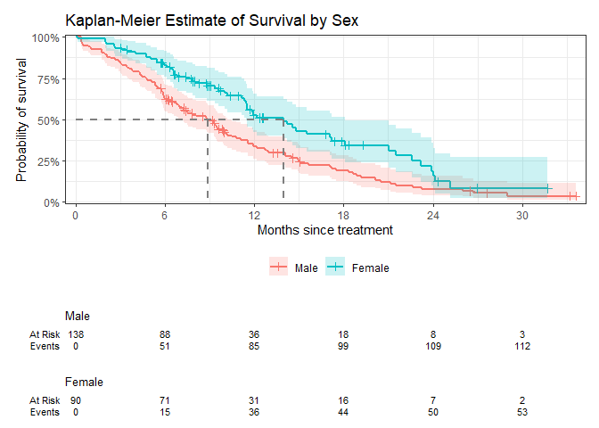
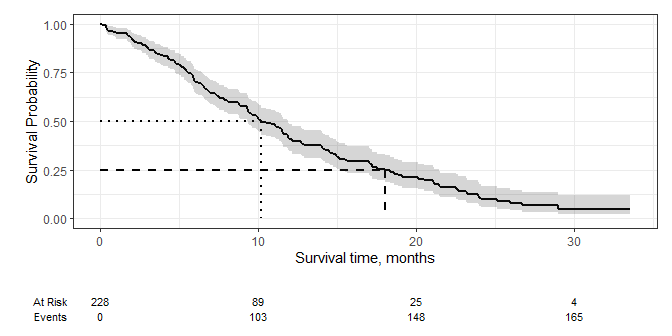
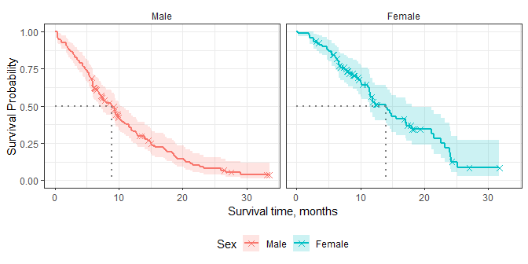
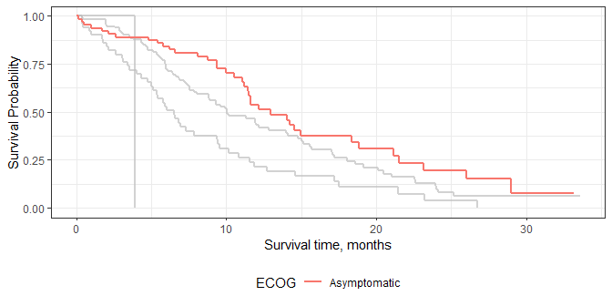
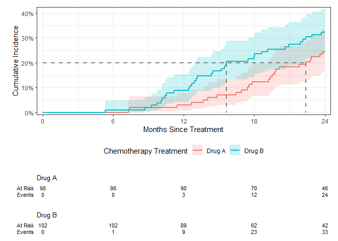

<!-- README.md is generated from README.Rmd. Please edit that file -->

# ggsurvfit

<!-- badges: start -->

[](https://lifecycle.r-lib.org/articles/stages.html#experimental)
[](https://CRAN.R-project.org/package=ggsurvfit)
[](https://app.codecov.io/gh/ddsjoberg/ggsurvfit?branch=main)
[](https://github.com/ddsjoberg/ggsurvfit/actions/workflows/R-CMD-check.yaml)
<!-- badges: end -->

## Introduction

The {ggsurvfit} package eases the creation of time-to-event (aka
survival) endpoint figures with ggplot. The concise and modular code
creates images that are ready for sharing or publication. Each of the
functions that add to or modify the existing ggplot are written as
proper ggplot geoms or stat methods, allowing the functions from this
package to be combined with functions from ggplot and other ggplot
extensions.

It’s recommended to use the `survfit2()` function with this package,
rather than `survival::survfit()` to ensure all quantities are able to
be calculated from any environment the functions are called.

## Installation

You can install the development version of ggsurvfit from
[GitHub](https://github.com/ddsjoberg/ggsurvfit) with:

``` r
# install.packages("devtools")
devtools::install_github("ddsjoberg/ggsurvfit")
```

## Examples

Let’s begin with an example illustrating a common Kaplan-Meier survival
curve.

``` r
library(ggsurvfit)
library(ggplot2)

p <- 
  survfit2(Surv(time, status) ~ sex, data = df_lung) |>
  ggsurvfit() +
  add_censor_mark() +
  add_confidence_interval() +
  add_risktable() +
  add_quantile(color = "gray40")
p
```


<hr>

Because each of the functions are written as proper ggplot geoms, you
can add any ggplot function to modify the figure.

``` r
p +
  theme(legend.position = "bottom") +
  labs(
    y = "Probability of survival",
    x = "Months since treatment",
    title = "Kaplan-Meier Estimate of Survival by Sex",
    # remove the fill and color legend labels (Sex appears in title)
    fill = "", color = ""
  ) + 
  # reduce padding on edges of figure, and format axes
  scale_y_continuous(label = scales::percent, expand = c(0.01, 0)) +
  scale_x_continuous(breaks = 0:5*6, expand = c(0.02, 0))
```



<hr>

The package also supports unstratified models and you can add multiple
quantile guidelines.

``` r
survfit2(Surv(time, status) ~ 1, data = df_lung) |>
  ggsurvfit() +
  add_quantile(linetype = 3) +
  add_quantile(y_value = 0.25, linetype = 2) +
  add_confidence_interval() +
  add_risktable()
```



<hr>

You can even facet…but you *cannot* facet with the risktable, however.

``` r
survfit2(Surv(time, status) ~ sex, data = df_lung) |>
  ggsurvfit() +
  add_censor_mark(shape = 4) +
  add_quantile(linetype = 3) +
  add_confidence_interval() +
  ggplot2::facet_grid(~strata)
```



<hr>

The package works seamlessly with other ggplot extension package, such
as {gghighlight}.

``` r
survfit2(Surv(time, status) ~ ph.ecog, data = df_lung) |> 
  ggsurvfit() +
  ggplot2::labs(color = "Gender") +
  gghighlight::gghighlight(strata == "Asymptomatic", calculate_per_facet = TRUE)
#> Warning: Tried to calculate with group_by(), but the calculation failed.
#> Falling back to ungrouped filter operation...
```



<hr>

The package also plots cumulative incidence estimates in the presence of
competing events.

``` r
library(tidycmprsk)

cuminc(Surv(ttdeath, death_cr) ~ trt, trial) %>%
  ggcuminc(outcome = "death from cancer") +
  add_confidence_interval() +
  add_quantile(y_value = 0.20) +
  add_risktable() +
  labs(x = "Months Since Treatment") +
  theme(legend.position = "bottom") +
  scale_y_continuous(label = scales::percent, expand = c(0.02, 0)) +
  scale_x_continuous(breaks = 0:4 * 6, expand = c(0.02, 0))
```


